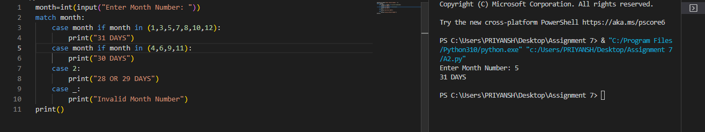
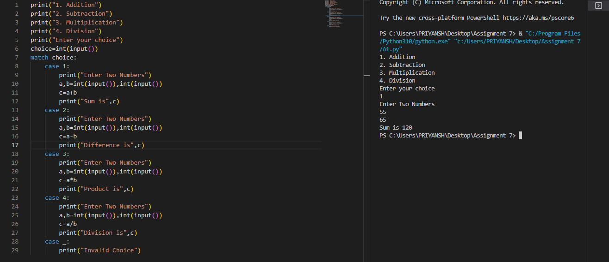
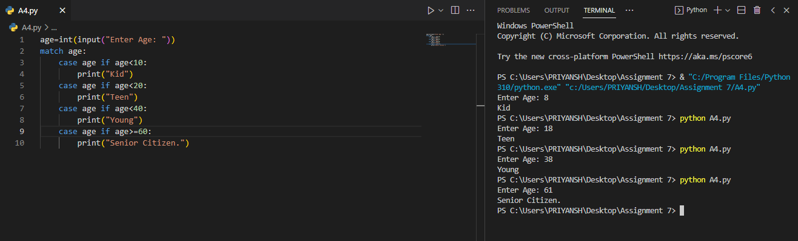
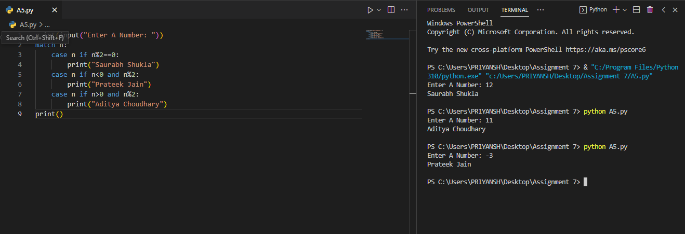
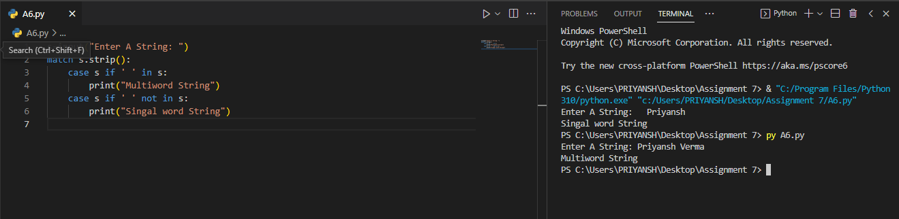
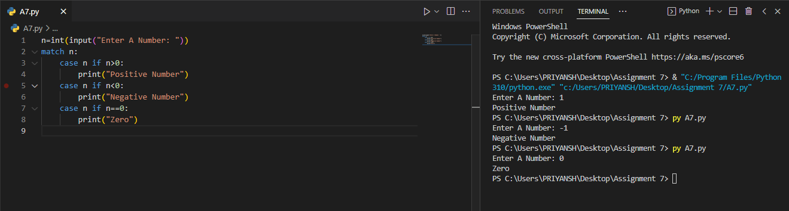
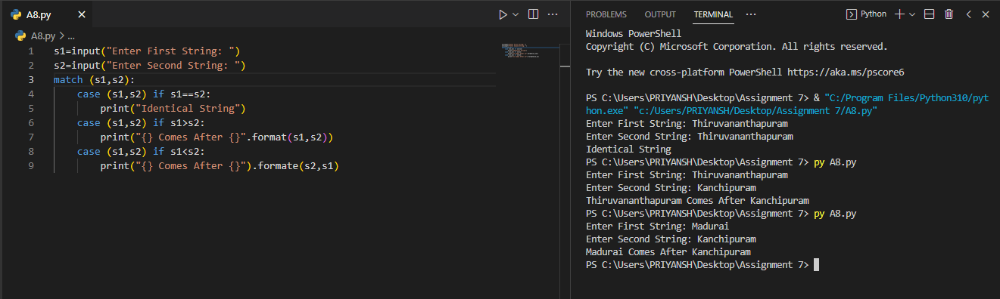
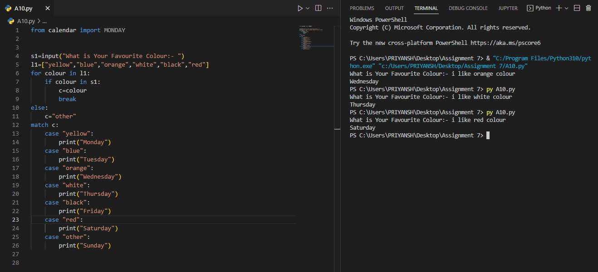

# Assignment - 7 Full Stack Web Development using Python MySirG Match Case

    Qns 1. Write a python script to display the number of days in a given month number.

    Ans.

    Qns 2. Write a menu driven program to perform following operations - Addition, Subtraction, Multiplication, Division .

    Ans.

    Qns 3. Write a menu driven program with the following options:
    
            a. Check whether a given set of three numbers are lengths of an isosceles triangle or not.

            b. Check whether a given set of three numbers are lengths of sides of a right angled triangle or not.

            c. Check whether a given set of three numbers are equilateral triangle or not.

            d. Exit.

    Ans.

    Qns 4. Write a program which takes user’s age and display the category of person. Age below 10 years- Kid, Age below 20 - Teen, Age below 40 - young, Age below 60 - Experienced, Age above or equal 60 - Senior Citizen.

    Ans.

    Qns 5. Write a program which takes a number from user. Print Saurabh Shukla if the number is even, print Prateek Jain if the number is negative odd number and print Aditya Choudhary if number is positive odd number.

    Ans.

    Qns 6. Write a python program to check whether a given string is a multiword string or single word string using match case statement. 

    Ans.

    Qns 7. Write a python program to check whether a given number is positive, negative or zero using match case statement.

    Ans.

    Qns 8. Write a python script to check whether two given strings are identical, first string comes before the second in dictionary order or first string comes after the second string in dictionary order using match case statement.

    Ans.

    Qns 10. Write a program to display day name on the basis of user’s liking of a colour. Ask user for his favorite colour. User can answer in a sentence like “I like red colour” Assuming all colour name entered by user is in lowercase. Use match case to display day name associated with the colour.
        a. Yellow - Monday
        b. Blue - Tuesday
        c. Orange - Wednesday
        d. White - Thursday
        e. Black - Friday
        f. Red - Saturday
        g. All other colours - Sunday

    Ans.
